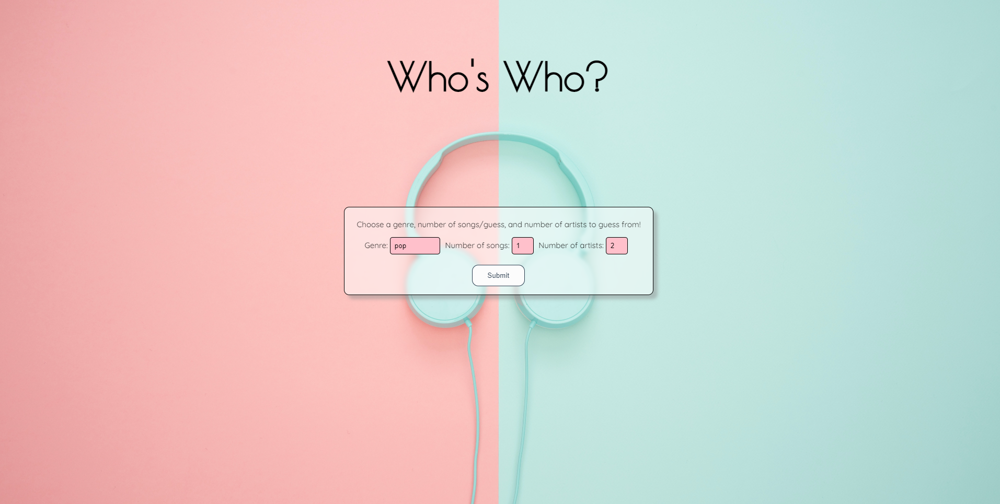
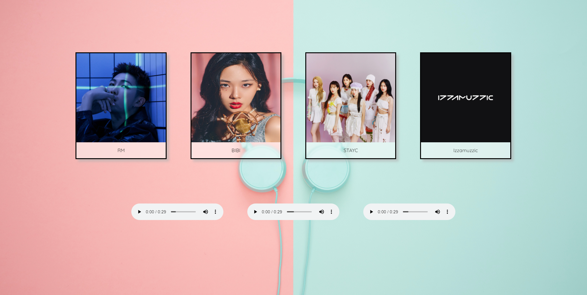
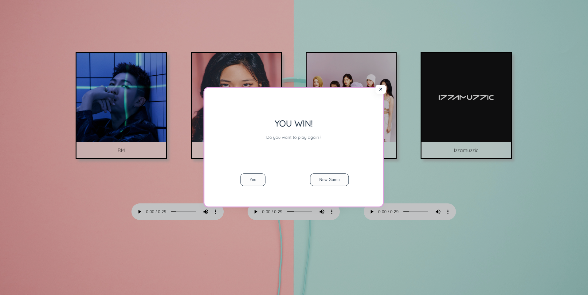

# Spotify Guessing Game
This application is a fun game where users can choose a music genre, the number of songs they want to listen to, and the number of artists they want to guess from and guess WHO is the artist of the songs.

Project Prompt:

## Technology

- Built with React.js, JSX, HTML, CSS, Expressjs, Node.js, Git, Vercel, and Google Fonts

- This full stack application has built in unit, integration, and e2e tests. Each test is split up by user story. To install this application, you must:

## Links

[Deployed Version](https://spotify-game.vercel.app/)

## Screenshots 
### Home:

The Homepage has the following features:

- A Dropdown to select the genre of music.
- A Dropdown to select the number of songs.
- A DropDown to select the number of artists to choose from.
- A Submit button to go to the game page.

### Game Page:

- Play each song and then click the artist you think the song belongs to.

### Correct Guess:

- If you guess correctly you see the "You Win!" pop up.
- You can either replay with the current parameters or go back to home to play with new parameters.

### Incorrect Guess:

- If you guess incorrectly it tells you the correct artist.
- You can choose to play again with the same parameters or go back to home and select new parameters.

